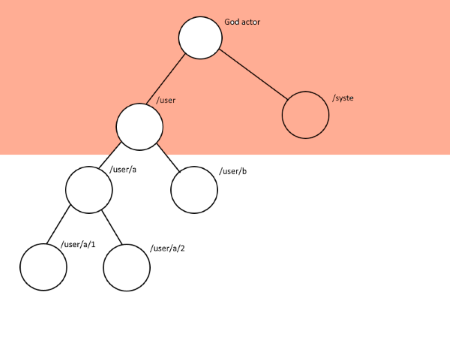
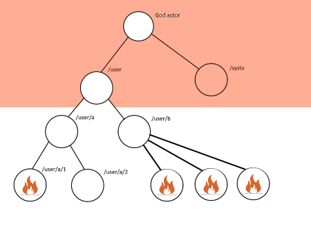

- title : Actor systém za pomoci Akka.Net
- description : vývoj konkurentních systémů
- author : Jarda Jirava
- theme : night
- transition : default

***

## Actor systém za pomoci Akka.Net

### vývoj konkurentních systémů

Jarda Jirava - Software architect @ Creditinfosolutions

***

### Proč bychom se měli zaměřit na konkurentní vývoj?

' od roku 1970 do roku 2005 jedou všechny systémy na jednom motoru a ke zvýšení výkonu se používá Mooroov zákon

***

### Skutečně potřebujeme konkurentní zpracování

- Konkurentní
- Paralelní
- Asynchronní

***

### Proč je to vlastně tak složité?

- nedokážeme snadno přemýšlet konkurentně
- ladit kód není jednoduché

---

### Co všechno si musíme připravit

#### Sdílený stav a k němu

- najít oblasti, kde můžeme kód paralelizovat
- zapojit mechanismus zařazování kódu do front
- použít synchronizační mechanismy
- dokončit a spojit rozdělanou práci na jednom threadu
- nejspíše zkonzumovat výsledek na jiném threadu

---

### Co všechno si musíme ověřit

- jsou používané třídy thread-safe?
- nebude docházet k deadlockům?
- nedostane se sdílený stav do nekonzistentního stavu?
- jsou vývojáři schopni napsat to správně?

***

### Prostředky máme

**Thread class** již od .NET 1.0
  
**Task - TPL** od verze .NET 4.0

**async/await** od verze .NET 4.5

Ale je to dostačující a dostatečně __blbuvzdorné__?

***

### Actor model/systém

' obrázek s herci

---
### Jak to vzniklo

- myšlenka vznikla v roce 1973

#### Nejznámější implementace
- Erlang - vytvořen firmou Ericsson pro spojování hovorů 
- Akka - postavená nad JVM
- Akka.Net - port Akka
- Orleans - MS zjednodušení actor modelu
 
' Ericsson switch měl uptime 99.9999999% v roce 1996

***

### Všechno je actor

- aktoři jsou fundamentální jednotkou pro práci a řešení konkurentnosti
- mají základní možnosti
- musí také splňovat předpoklady
- jsou jednoznačně identifikováni

---
### Actor jako fundamentální jednotka pro práci a řešení konkurentnosti

- veškerá komunikace je řešena pomocí předávání zpráv
- všechny zprávy jsou **immutable**
- odesílatel a příjemce zprávy jsou odděleny a zpracování je asynchronní

' každá zpráva musí být imutable, jinak hrozí, že aktor změní obsah zprávy a nebude tak zaručen základní princip aktor modelu

---
### Actor a jeho základní možnosti

- aktor může zpracovat příchozí message
- může vytvořit dalšího aktora a nebo potomka (child actor)
- může změnit svoje chování mezi jednotlivým zpracováním message
- může obsahovat stav
- může poslat další zprávu jinému aktoru

---
### Actor a jeho předpoklady

- jedním aktorem je zpracovávána jen **jedna** zpráva
- zprávy jsou zpracovávány v pořadí v jakém přišly (FIFO)
- je garantováno "At most once" doručení

' je garantováno nejvýše jedno doručení zprávy

---
### Actor a jeho jednoznačná identifikace

- aktor je identifikován jednoznačnou adresou v systému
- komunikace mezi aktory je zajištěna přes aktor referenci

akka.tcp://mc-server@localhost:9001/user/query

' nejedná se o klasickou referenci, jak ji známe ze C# jazyka, ale o referenci na adresu aktora

*** 
### Hierarchie aktorů

- God actor
	- System actor
	- User actor

	
#### User aktoři
- top level aktoři
- další hierarchie aktorů

' se system a user aktorem nemáme možnost komunikovat 

---

### Supervize aktorů

- na každý aktor dohlíží rodičovský aktor
- aktor propaguje chybu na vyšší aktor, který rozhoduje
	- OneForOne supervize
	- AllForOne supervize

' zmiňoval jsem se o tom, že Ericsson dokázal mít vysoce dostupný systém, právě za pomoci aktorů. Jak toho dosáhnul?
' pokud mi failuje aktor, neshodím si celý systém, ale pouze tento aktor, který propaguje svůj error stav na svého rodiče
' rodič rozhoduje, co se bude dít s jeho dítětem nebo dětmi

---

### Životní cyklus aktora

- Starting = inicializace aktora
- Receiving = aktor je inicializován a může přijímat zprávy
- Stopping = aktor je pozastavován
	- Terminated = kompletní zrušení aktora
	- Restarting = aktor je zrestartován a může přejít do stavu Starting

***

#### Jak vypadá nejjednodušší aktor

	[lang=cs]
	public class SimpleActor : UntypedActor {
		protected override void OnReceive(object message) {
			// message handling
		}
	}

' nebojte se vytvářet aktory. Vytvořit Thread znamená ~ 1MB paměti (4MB an 64 bit procesoru).
' aktorů se vejde do 1GB přibližně 2.5 milionu

---

### Jak může vypadat message

	[lang=cs]
	using System;
	public class SimpleMessage  {
		
		public SimpleMessage(string text) {
			Text = text;
		}
		
		public string Text {get; private set;
	}

#### nebo také
	type SimpleMessage(text: string) = 
		member this.Text = text
	

***

### DEMO

***

### Potřebujeme škálovat = Akka.Remote

- jen změnou konfigurace můžeme změnit chování
akka.actor.provider = "Akka.Remote.RemoteActorRefProvider, Akka.Remote"
- distribuovaný __by default__
- stejný přístup, ať pracujeme na jednom systému nebo s více systémy

' už jsem zmíňil, že škálovat za pomoci zvyšování výkonu procesoru není v současné době příliš možné
' škálovat můžeme rozložením výkonu do šířky (scale out)
' HOCON - Human Optimized Config Object Notation

***

### Potřebujeme škálovat = Routing

#### Router => Routee
- Broadcast
- RoundRobin-Pool
- Random
- SmallestMailBox
- ConsistentHashing
- TailChopping
- ScatterGatherFirstCompleted

' Broadcast, jak název napovídá, rozešle zprávu z routeru na všechny jeho Routee
' Round robin prochází jednotlivé své routee a každému pošle jednu zprávu do jeho mailboxu
' Tail chopping - pošle message na všechny a pokud actor neodpoví do stanoveného času, tak vybere jiný actor, kterému zprávu pošle

***

### Kde můžeme tento přístup použít

- analytické systémy
- multi-player hry
- IoT tracking
- alerty a monitorovací systémy
- doporučovací systémy
- reaktivní UI

***

### Prostor pro vaše otázky